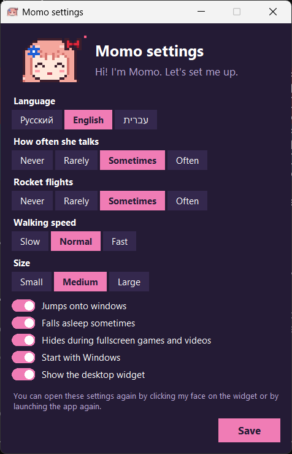

# Momo, Israel-chan desktop pet

A small pixel girl who lives on your Windows desktop. She walks along the tops of your windows, every now and then takes off on a rocket, and floats back down on a parachute. She also talks, in Russian, English or Hebrew, whichever you pick.

I made her for myself, but maybe someone else will like her too.


## Download

[MomoPet.exe](https://github.com/Un1-Hun1/Israel_chan-destkop-pet/releases/latest/download/MomoPet.exe) (latest version, a single file, nothing to install)

Put it in any folder and run it. Windows will probably say "Windows protected your PC" because the app isn't signed (signing costs money). Click "More info" and then "Run anyway".

## First launch

On the first launch a settings window pops up where you choose:

- the language she speaks (Russian, English or Hebrew; she only uses the one you pick, and the settings window switches too)
- how often she talks and how often she goes for a rocket ride
- walking speed and size
- whether she jumps onto windows, falls asleep, hides during fullscreen games and videos
- whether she starts with Windows and whether the desktop widget is shown



You can open the same window later by clicking her face on the desktop widget, or by launching the exe again.

## What she does

She walks on the taskbar and on the top edges of windows. She can sit on a window and swing her legs; drag that window around and she rides along with it. Close it and she falls.

Every so often she hops on a rocket and flies around the screen, then bails out and drifts down on a parachute.

A thought bubble pops up above her head from time to time.

You can grab her with the mouse and throw her, or click her (she likes that). If nothing happens for a while she dozes off.

## Controls

The small widget on the desktop turns her on and off. Click her face on it to open the settings. Right-click the widget for a menu: settings, call her over to the widget, quit.

Right-click Momo herself to pat her, ask her to say something, send her off on the rocket, or hide her.

## Your own phrases

After the first launch a `phrases` folder appears next to the exe with `ru.txt`, `en.txt` and `he.txt`. Open the one for your language in Notepad and add whatever you want, one phrase per line. A `|` breaks the line in two.

```
[random]
Did you remember to save your work?
```

No restart needed, she picks up new phrases on her own.

## Running from source

You need Python 3.11+ and Pillow:

```
pip install pillow
pythonw pixelpet.pyw
```

Building the exe:

```
pip install pyinstaller
python -m PyInstaller --onefile --noconsole --name MomoPet --icon icon.ico --add-data "phrases;phrases" --add-data "icon.ico;." pixelpet.pyw
```

## Notes

All the sprites are drawn by hand in code, see `sprites.py`. The character is a fan nod to the Israel-chan meme; this is a non-commercial project.

MIT license, do whatever you want with the code.
